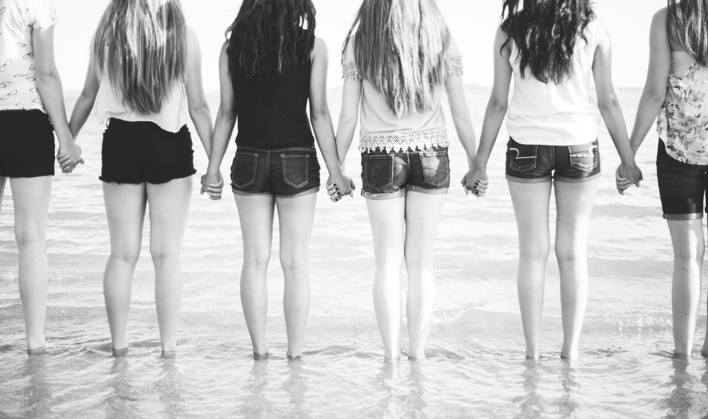
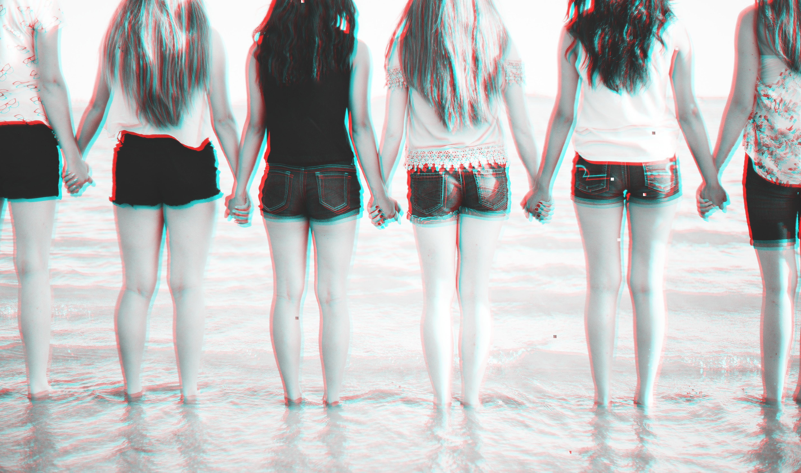

# DouyinImage

生成抖音风格的图片。Have Fun！😊

## 安装

在你的Gemfile中添加下列代码：

```ruby
gem 'douyin_image'
```

然后执行下列命令：

```shell
$ bundle
```

或者是使用下列命令直接安装gem：

```shell
$ gem install douyin_image
```

## 使用

### 方法调用

当你需要在项目中使用时，可以通过下列代码进行调用：

```ruby
# generate Douyin style image with the input image
#
# @param file_path String - image file path
# @param output_path String - output directory, default: same with input file
# options:
#   offset: the R channel image offset, default: 8
#   part_count: the small part's count, default: rand(5..10)
#   part_width: the small part's width, default: rand(10..30)
#   part_height: the small part's height, default: rand(10..30)
#
# Example:
#   DouyinImage.generate('./test.jpg', './test/', {offset: 10})
#

DouyinImage.generate(file_path, output_path=nil, options={})
```

### 命令行

你也可以通过下列命令查看支持的选项以及操作

```shell
$ douyin --help

Usage: douyin [options]

Specific options:
    -i, --input IMAGE_PATH           the input image's path
    -o, --output [OUTPUT_PATH]       the custom output path
    -f, --offset [OFFSET]            the R channel image offset
    -c, --count [COUNT]              the small part's count
    -w, --width [WIDTH]              the small part's width
    -h, --height [HEIGHT]            the small part's height

Common options:
        --help                       Show the help message
        --version                    Show version
```


## 例子

```ruby
命令行调用：
$ bundle exec douyin -i './tmp/input.jpg' -o './tmp/' -f 20 -c 10

或者是：
DouyinImage.generate('./tmp/input.jpg', './tmp/', {offset: 20, part_count: 10})
```

### 输入图片




输出结果



## 如何贡献

1. Fork it
2. Create your feature branch (`git checkout -b my-new-feature`)
3. Commit your changes (`git commit -am 'Add some feature'`)
4. Push to the branch (`git push origin my-new-feature`)
5. Create new Pull Request

欢迎贡献相关代码或是反馈使用时遇到的问题👏，另外请记得为你的代码编写测试。